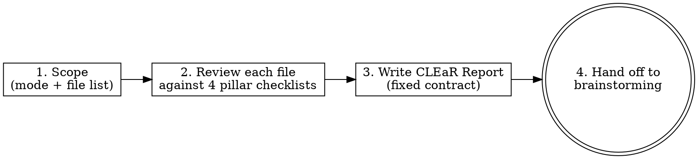

# CLEaR Review

Review-only skill. It produces evidence-based findings under four pillars — **C**lean, **L**ightweight, **E**fficient, **R**obust — and a prioritized Plan of Attack. It does NOT change code.

Adapt the checklists to the project's actual stack (language, framework, runtime, cloud services). The Efficient pillar is especially valuable for apps that pay per-use for backend services (databases, serverless functions, object storage, bandwidth) — Firebase/Firestore/Cloud Functions/Cloud Storage, or any equivalent.

**This skill works the same on any model.** Follow the recipe literally: fill every REQUIRED field, run every checklist item, ground every finding in a real `file:line`. Do not improvise structure.

**Pairs with (optional):** the Superpowers plugin — `brainstorming`, `test-driven-development`, `requesting-code-review`, `verification-before-completion`, `writing-plans`. CLEaR hands off to these for remediation. If they are not installed, treat each handoff as "use your own equivalent step" — the review contract and Plan of Attack are fully self-contained.

## The one hard rule

**Review only. Produce findings + a Plan of Attack. Then STOP and hand off to the `brainstorming` skill.**

- Do NOT edit, refactor, or delete anything during a CLEaR review — not even "obvious" fixes or comments.
- Do NOT begin implementation. The Plan of Attack is a proposal; the user approves the remediation design (via `brainstorming`) before any code changes.
- The terminal action of a CLEaR review is the report + handoff to `brainstorming`. Nothing else.

## When to use

- **Scoped mode (default):** after finishing an update/feature, or before merge. Review the change set (a diff, a branch, or a named set of files/modules).
- **Exhaustive mode:** a full-codebase health pass "once all the work is done." Review the whole tree in prioritized batches (see Scoping). When the resulting Plan of Attack is too big to execute in one session, drive remediation with the master-plan + per-track/per-wave chat-prompt scaffolding in `references/exhaustive-remediation.md`.

If the mode is unclear, ask which one. Default to Scoped.

## Workflow



The terminal state is invoking `brainstorming`. Do not invoke any implementation skill yourself.

## 1. Scope

Produce an explicit file list before reviewing.

- **Scoped:** derive the list from the diff/branch/changed files. `git diff --name-only <base>...HEAD` for a branch, or use the files the user named.
- **Exhaustive:** enumerate the tree, then batch by risk-weighted priority so a review stays focused and cheap:
  1. Security / data / cost surfaces first: access-control rules, infra/config, serverless functions, and any module that performs database, storage, or network I/O.
  2. Largest / most-central modules next — highest payoff for Clean and Lightweight.
  3. Everything else.
- Review **one batch at a time**. Emit one report per batch, labeled `batch X of Y`. Never claim an exhaustive review is complete until every batch has a report.

State the scope and file list at the top of the report. Do not review files you have not actually read.

## 2. Review — the four pillars

For every file, walk all four checklists. Ground each finding in a real `file:line` you have read. If you are inferring behavior you did not verify (e.g. a caller in another file), either verify it or label the finding **[unverified]** — never present a guess as fact.

To verify a cross-file claim cheaply, search the tree for the symbol (e.g. grep the export/function name) and open the hit; cite that `file:line`. Do not write "verified" unless you actually opened the referenced line. If you only suspect a usage, mark it **[unverified]**.

### Clean (C)
- Dead / unreachable / commented-out code, unused exports, imports, variables, params.
- Duplicated logic that repeats a pattern already defined elsewhere.
- Redundant or superseded code paths (old fallbacks, migrations, feature flags no longer needed).
- **Comments:** the standard is **no comments**. Do NOT recommend adding comments. Every existing comment is a removal candidate. BUT do not silently delete valuable ones — instead list them under **Comments flagged to keep** with a one-line reason (see contract). A comment earns a keep-flag only if it encodes non-obvious intent, a constraint, a workaround rationale, or a link to an issue the code cannot express itself. "Explains what the code does" is not a reason to keep.

### Lightweight (L)
- Oversized files/functions doing too much; propose focused splits (name the modules) or extraction of shared helpers.
- Boilerplate repeated across functions (e.g. repeated guard clauses, repeated try/catch shapes) → one helper.
- Verbose constructs that a simpler form expresses identically (long `if` chains copying fields → allowlist/loop).
- Redundant abstractions or indirection that add no value.
- Refactors that improve stability/testability (module-level side effects that block testing, hidden global state).

### Efficient (E) — backend/usage cost is first-class
Every E finding MUST state its **cost impact** (which resource, rough magnitude). Check, where the stack applies:
- **Database reads:** unbounded queries (no limit), reading whole collections/tables, N+1 read loops, over-fetching full records when a projection/field selection would do, client-side filtering of data that could be filtered server-side, redundant re-reads a cache/subscription would avoid.
- **Database writes/deletes:** writing unchanged data, per-item writes that could batch, chatty updates, missing debounce/coalescing on save queues.
- **Realtime subscriptions/listeners:** subscriptions left attached, duplicated subscriptions, cases where a one-time read suffices.
- **Object storage:** re-uploading unchanged blobs, re-downloading cacheable assets, oversized images/thumbnails, repeated signed-URL fetches, serving originals where a smaller derivative works (egress).
- **Serverless functions:** invocation frequency, cold starts, over-provisioned memory/timeout, work that belongs client-side, N+1 in functions.
- **Client / network / device:** oversized payloads, main-thread jank, layout thrash, redundant round-trips, service-worker cache correctness (stale/duplicate caching), memory growth.

### Robust (R)
- Error handling: swallowed errors that hide failures, missing catches on I/O, unhandled rejections.
- Correctness: loose vs strict equality, off-by-one, race conditions, missing settle guards, unawaited promises.
- Offline/auth and other edge cases: failure surfaced vs silently degraded, retry/reconnect correctness.
- Security: overly permissive access-control rules (e.g. allow-all), missing ownership/authorization checks, trusting client input.
- Deprecated/fragile APIs (e.g. patching library internals, deprecated calls), dependency-upgrade hazards.
- Input validation and boundary handling.

## 3. Output contract (fill every field)

Produce exactly this structure. Keep prose tight; no "Strengths" padding, no restating the code.

```
## CLEaR Review Report

**Scope:** <mode: Scoped | Exhaustive> — <what was reviewed> (batch X of Y if exhaustive)
**Files reviewed:** <path (line count)>, ...
**Summary:** <=3 sentences: overall health + the biggest wins.

### Findings

For every finding use this block. IDs are per-pillar and sequential (C1, C2, L1, E1, R1...):

- **<ID>** `path:line` — **Severity:** Critical|High|Medium|Low · **Effort:** S|M|L · **Risk:** Low|Med|High · **Class:** Fix|Preserve-invariant|Verify-intent|Won't-fix
  - **Finding:** what is wrong (1-2 sentences, evidence-based; mark [unverified] if not confirmed).
  - **Recommendation:** the concrete change. For Verify-intent, give the question to answer first — do NOT propose a fix yet.
  - **Invariant:** (required for Preserve-invariant and Verify-intent) the behavior that must NOT change, or why it may be deliberate.
  - **Cost impact:** (E findings only) resource + rough magnitude.

Group findings under these headings, in this order. If a pillar has none, write "None found."

#### Clean (C)
#### Lightweight (L)
#### Efficient (E)
#### Robust (R)

### Comments flagged to keep
`path:line` — "<the comment>" — <one-line reason it earns its place>.
(If none: "None — all comments are safe to remove.")

### Backend cost impact summary
Bullet the E findings that cut database reads/writes/deletes, storage egress, or function usage, each with rough magnitude. (If none: "No backend cost findings.")

### Plan of Attack
Ordered waves, sequenced by value ÷ effort ÷ risk (quick high-value low-risk wins first; large refactors last). One wave = one branch commit/PR. For each wave state: the finding IDs, a one-line rationale, dependencies/ordering, the **Tier** (minimum model tier allowed to implement it — see Implementation risk gate), the **Review** tier (R0 automated-only | R1 cheap review | R2 strong review — see definitions), a **Safety net** (tests/smoke to add or run before the wave), and **Verify** (checks to run after).

- **Wave 1 — <name>:** IDs: <IDs> · Tier: <Any | Capable | Strongest+review> · Review: <R0 | R1 | R2> · Safety net: <what to lock in first> · Verify: <what to run after> — <why first>
- **Wave 2 — ...**

### Next step
State: "Review complete — no code changed. Handing off to the brainstorming skill to turn this Plan of Attack into an approved remediation design before any implementation."
```

### Severity / Effort / Risk definitions
- **Severity:** Critical = data loss, security hole, or runaway cost. High = clear bug, meaningful cost, or fragility likely to break. Medium = maintainability/perf worth fixing. Low = nit.
- **Effort:** S ≈ minutes, localized. M ≈ one module/session. L = cross-cutting refactor.
- **Risk (of making the change):** Low = mechanical/safe. Med = touches shared behavior. High = broad blast radius or hard to verify.
- **Model tier (who may implement a wave):** derived from the wave's highest-Risk finding. Low → **Any** model. Med → **Capable** model, or a cheaper model whose diff is reviewed by a strong model or human. High → **Strongest tier + mandatory diff review** (strong model or human) before merge. Never batch a High-risk finding into a wave with others.
- **Review tier (how expensive the wave's diff review should be):** derived from Class × Risk × safety-net, so a review never costs more than the work it guards. **R0** = automated gate only (tests + lint/build green **and** a diff-scope check; no LLM) — for Low-risk pure `Fix` with an authoritative safety net (dead-code/comment deletion, dep bumps). **R1** = cheap-model diff review — for Low-risk `Fix` touching live code with a passing characterization test. **R2** = strong-model (or human) diff review — for **any** Preserve-invariant, Med/High risk, security/access/data/cost surface, or no-safety-net wave. Any R0/R1 wave **escalates to R2** on a failed check, out-of-scope diff, or lower-tier flag. R0's safety depends on a real net — an untested dead-delete is R2, not R0.

### Finding class (triage — what remediation should do)
Classify every finding so the remediation phase does not blindly "fix" load-bearing behavior.
- **Fix:** clear defect or safe improvement; remediate directly.
- **Preserve-invariant:** a real issue, but the current behavior is load-bearing. State the Invariant the fix must keep (e.g. "must still return the full search set", "must not delete shared media"). Change the mechanism, not the observable contract.
- **Verify-intent:** looks like a defect but may be deliberate — especially anything touching security-integration paths, auth/offline boot, cache/prefetch correctness, data-collection/telemetry, or service-worker matching. Do NOT propose a fix; state the question to confirm intent first. Only after confirmation does it become Fix / Preserve-invariant / Won't-fix.
- **Won't-fix:** integral by design, ops-only, or cost-of-change exceeds benefit (e.g. large god-file splits, full-collection scans in maintenance scripts). Record and move on.

**Default to Verify-intent over Fix whenever a behavior could be intentional.** A finding is not automatically a defect. The failure mode to avoid is defect-elimination bias: treating every finding as something to delete, and thereby breaking an integration, a correctness guarantee, or an offline path.

## 4. Hand off

After the report, invoke the `brainstorming` skill to design the remediation for the approved subset of findings. Do not write code, scaffold, or edit until the user approves that design.

## 5. Implementation risk gate (for the remediation phase)

CLEaR does not implement. But the Plan of Attack it emits is the contract the remediation must follow, so findings can be fixed cheaply without breaking code — even on a lesser model. Whoever implements (any model) MUST:

- **Work wave-by-wave on a branch; one commit/PR per wave.** Never combine waves. This keeps every change small and revertible (`git revert` the wave if it regresses).
- **Honor the wave Tier.** Low-risk: any model. Med: a capable model, or a cheaper model whose diff is reviewed by a strong model or human. High: strongest tier and a mandatory diff review before merge. When in doubt, escalate.
- **Establish the Safety net before any behavior-changing (Med/High) wave.** Add characterization tests on the affected logic and/or a written smoke checklist for the affected surfaces, and confirm they pass on the current code first. Do not refactor behavior with no net — this matters most in codebases with few tests or no compile-time checks. Use the `test-driven-development` skill: write/confirm the test before touching behavior. If the code cannot be tested without first extracting a pure unit, that extraction is its own low-risk wave — do it first, under its own net.
- **Keep diffs minimal.** Change only what the wave's finding IDs require; do not touch code outside the wave, and do not "drive-by" refactor. Preserve public entry points and update every import site / manifest when moving or splitting modules.
- **Verify after each wave** (run its Verify checks — tests, lint, build where they exist, plus the smoke checklist) and commit only when green. Then review the diff **at the wave's Review tier** — R0 automated-only, R1 cheap review, R2 strong review (see definitions) — so a review never costs more than the work it guards; escalate to R2 on any failed check, out-of-scope diff, or flag. A diff review is the cheapest guardrail (reviewing a diff costs far less than regenerating it), so R1/R2 pair well with a cheap implementer. Use the `requesting-code-review` skill for R1/R2, and the `verification-before-completion` skill to require passing-check evidence before a wave is called done.
- **Leave vendored/generated files alone** unless a finding names them.
- **Confirm Verify-intent findings before touching them.** Do not implement a Verify-intent finding until its intent question is answered by the user or by evidence. If the behavior is deliberate, it becomes Won't-fix or Preserve-invariant — not a deletion.
- **Execute each wave in a fresh context.** Do NOT run a whole remediation in one long session — a large plan overflows any model's working memory and a cheaper model degrades fastest. Start each wave from a clean session (or a dedicated subagent) seeded only with the plan file and that wave's brief. The written plan is the memory, not the chat history.
- **Each wave brief must be self-contained and re-verified.** A review is a snapshot; line numbers drift, so re-locate every finding in the current code before editing. A brief that a fresh session can execute alone contains: finding IDs, re-verified `file:line`, the exact scope ("touch only these"), the Invariant(s) to preserve, the Safety net, the Verify checks, and the acceptance criteria.
- **Decompose a large/exhaustive review into tracks first.** If the Plan of Attack is too big for one design (e.g. security + cost + data-integrity + refactors), split it into independent tracks; each track gets its own `brainstorming` design and its own `writing-plans` plan. Do not attempt one mega-spec. For the full master-plan template, standard wave steps (incl. the self-review handoff), and copy-paste design/execution chat prompts, follow `references/exhaustive-remediation.md`.

If any of these cannot be met for a wave, stop and surface it rather than proceeding.

## Common mistakes (from baseline testing)

| Mistake | Fix |
|---|---|
| Findings organized by file or ad-hoc headings | Always bucket under C / L / E / R in that order. |
| Efficiency findings with no cost number | Every E finding states resource + rough magnitude. |
| Missing unbounded database reads | Flag any query without a limit and any whole-collection/table fetch. |
| Recommending new comments, or deleting comments outright | No new comments; list keep-worthy ones under "Comments flagged to keep." |
| Vague severity ("high impact") | Use the Severity/Effort/Risk labels on every finding. |
| Stopping at a priority list | End with a waved Plan of Attack + brainstorming handoff. |
| Guessing about other files | Verify, or mark the finding [unverified]. |
| Editing "quick wins" during review | Review only. No edits. Ever. |
| Claiming exhaustive review done after a subset | One report per batch; not complete until every batch is covered. |
| Plan of Attack waves missing Tier / Review / Safety net / Verify | Annotate every wave (see Implementation risk gate). |
| Mandating a strong review on trivial waves | Assign a Review tier (R0/R1/R2) per wave; a review must not cost more than the work. |
| Sending a High-risk wave to a cheap model with no review | High → strongest tier + mandatory diff review; never batch High-risk with other findings. |
| Treating every finding as a defect to delete | Default to Verify-intent when behavior could be intentional; classify all findings. |
| Preserve-invariant / Verify-intent finding with no Invariant line | Fill in the Invariant, or the intent question to answer first. |
| Running a big remediation in one long session | Execute wave-by-wave in fresh contexts; the plan file is the memory. |
| Trusting the review's line numbers at edit time | Re-verify every finding's location at the start of its wave. |

## Red flags — you are doing it wrong if

- You edited a file.
- An E finding has no cost impact.
- You recommended adding a comment.
- A finding has no `path:line`.
- You skipped a pillar heading.
- There is no Plan of Attack, or you did not hand off to `brainstorming`.
- A Plan of Attack wave is missing its Tier, Review tier, Safety net, or Verify.
- A finding has no Class, or a Preserve-invariant / Verify-intent finding has no Invariant.
- You proposed a fix for a Verify-intent finding before its intent was confirmed.
